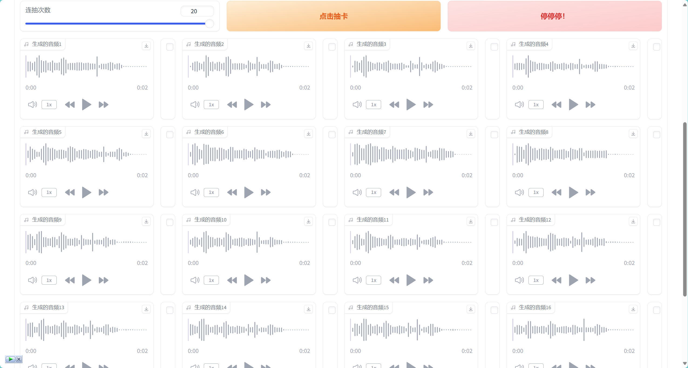
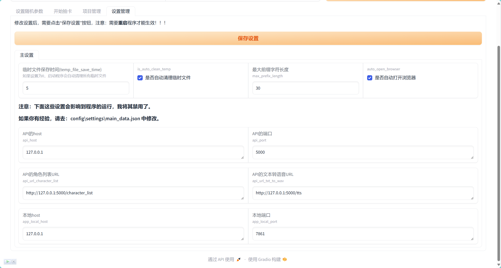
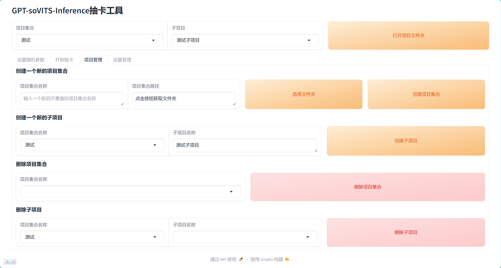
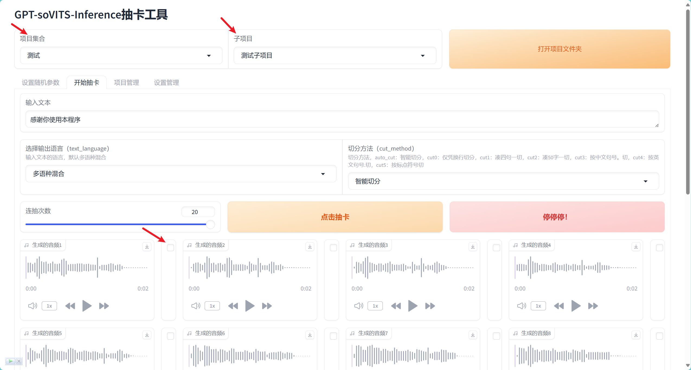

# GPT-soVITS-Inference批量抽卡工具

- [GPT-soVITS-Inference批量抽卡工具](#gpt-sovits-inference批量抽卡工具)
  - [功能简介](#功能简介)
  - [如何使用本项目？](#如何使用本项目)
    - [使用整合包](#使用整合包)
    - [手动搭建环境](#手动搭建环境)
      - [克隆项目](#克隆项目)
      - [安装依赖](#安装依赖)
      - [运行](#运行)
  - [详细介绍所有功能](#详细介绍所有功能)
    - [设置GPT-soVITS-Inference推理参数](#设置gpt-sovits-inference推理参数)
    - [GPT-soVITS-Inference开始批量抽卡页面](#gpt-sovits-inference开始批量抽卡页面)
      - [音频文件格式](#音频文件格式)
    - [设置页面](#设置页面)
    - [使用项目进行管理](#使用项目进行管理)
    - [使用GPT-soVITS进行批量推理](#使用gpt-sovits进行批量推理)
      - [1. 设置GPT-soVITS的项目文件夹和Python环境](#1-设置gpt-sovits的项目文件夹和python环境)
      - [2. 设置API启动参数](#2-设置api启动参数)
      - [3. 添加GPT-soVITS模型和参考音频](#3-添加gpt-sovits模型和参考音频)
      - [4. 设置推理参数](#4-设置推理参数)
      - [5. 启动GPT-soVITS的API文件](#5-启动gpt-sovits的api文件)
      - [6. 开始使用GPT-soVITS进行批量推理](#6-开始使用gpt-sovits进行批量推理)
  - [许可证](#许可证)
  - [常见问题（FAQ）](#常见问题faq)
  - [后续计划](#后续计划)

这是一个批量推理工具，对同一段文字进行多次推理，并且支持随机参数，直到筛选出最满意的结果

也可以称为**抽卡工具**，推理一次就像抽卡，抽一次可能不是最佳结果，需要一次又一次地抽卡，直到筛选出最满意的结果。

显然，手动点击的方式不够高效，这个工具就是为了解决这个问题而设计的，可以实现十连抽，二十连抽……

可以用于GPT-soVITS和GPT-soVITS-Inference（基于GPT-soVITS开发的，专注于推理的前后端语音合成的第三方推理包）

> GPT-soVITS : [项目地址](https://github.com/RVC-Boss/GPT-SoVITS) , [中文指南](https://www.yuque.com/baicaigongchang1145haoyuangong/ib3g1e)
>
> GPT-soVITS-Inference : [项目地址](https://github.com/X-T-E-R/GPT-SoVITS-Inference) , [中文指南](https://www.yuque.com/xter/zibxlp)
>
> GPT-soVITS-Inference提供了比较简单的API接口，文档也较为完善，API接口文档可以在[这里](https://www.yuque.com/xter/zibxlp/knu8p82lb5ipufqy)查看

## 功能简介

本项目使用了`gradio`包，提供了一个简单的前端页面，用于设置推理的参数，以及推理的文本，支持多次推理，最高支持20连抽，将所有结果展示在页面上，供用户选择。生成的所有音频文件都可以通过项目进行管理，将筛选出的音频文件保存到项目文件夹中，方便管理



## 如何使用本项目？

大概只能在Windows系统上运行

### 使用整合包

整合包只适用于Windows x64位的系统

本项目的环境搭建过程很简单，但考虑到一些小白用户，我做了一个整合包，将其上传到一些网盘

[蓝奏云网盘](https://wwo.lanzoub.com/b00mon47vi) 密码:cfre

[123网盘](https://www.123pan.com/s/y2I2jv-yLmU3.html)

下载整合包后，解压，运行`开始使用.bat`即可

### 手动搭建环境

#### 克隆项目

```shell
git clone https://github.com/Apauto-to-all/GPT-soVITS-Inference-batchTool.git
```

#### 安装依赖

本项目主要使用了 `gradio==4.39.0` ， `requests` 和 `mutagen` 可以通过以下命令安装

```shell
pip install -r requirements.txt
```

使用国内源：

```shell
pip install -r requirements.txt -i https://pypi.tuna.tsinghua.edu.cn/simple
```

#### 运行

```shell
python main.py
```

## 详细介绍所有功能

### 设置GPT-soVITS-Inference推理参数

使用前，需要手动启动`GPT-soVITS-Inference`的API接口，然后在页面上设置推理参数

`GPT-soVITS-Inference`的API接口可以设置不少推理用的参数，本项目支持设置大部分参数，这里不进行一一例举，具体的参数设置可以在`GPT-soVITS`和`GPT-soVITS-Inference`的文档中查看


如上图所示，包含了大部分可以设置的参数，其中有一些参数支持随机生成，比如：`情感`、`top_k`, `top_p`, `temperature`等，这些参数对推理结果有一定影响，可以设置一个范围，每次推理时随机生成一个值

每修改一个参数，都会自动保存到本地，下次打开页面时，会自动加载上次的设置

### GPT-soVITS-Inference开始批量抽卡页面

设置好参数后，切换到`开始抽卡`页面


页面很简单，输入**需要推理的文本**，选择**推理语言**，选择**切割文本方式**，再设置**推理次数**，最后点击**抽卡**按钮，程序会使用前面设置的参数生成多个（随机）结果，发送到API接口，进行推理，每推理一次，在页面上显示一条音频结果，直到全部结果推理完毕。

如果都不满意，可以再次点击抽卡按钮，重新推理

#### 音频文件格式

生成的音频文件为`wav`格式，`GPT-soVITS`和`GPT-soVITS-Inference`的推理下载的音频都是以`audio.wav`的形式返回的，难以区分，所以本项目解决了这个问题，将生成时间戳+推理文字前n个字符作为文件名，以区分不同的音频文件，例如：`1634160000_这是一个测试文本…….wav`。

如果有满意的结果，可以在音频右上角点击下载按钮，浏览器会自动下载音频文件。

如果你在意音频文件右边的复选框的话，这个是项目管理功能，将该音频复制到项目文件夹，详情看`使用项目进行管理`的介绍，跳转[使用项目进行管理](#使用项目进行管理)

### 设置页面

这个是`v1.1.0`版本新增的功能，支持在页面修改部分设置，重启程序后生效，后续可以添加更多的设置，不多说，直接上图



### 使用项目进行管理

这个是`v1.2.0`版本新增的功能，实用但不复杂，一句话概括：**将筛选出的音频文件保存到项目文件夹中，方便管理**

简单介绍一下，选择本地电脑的一个**文件夹**（最好为空文件夹），然后使用此**文件夹的路径**+**项目集合名**作为项目的唯一标识——创建项目集合成功。

创建好项目集合后，可以在**项目集合**中创建**子项目**，子项目的名字可以自定义（不能重复，最好有意义），子项目说白了，就是在项目集合的文件夹下创建的一个**子文件夹**，文件夹名与子项目名**相同**——创建子项目成功。

首先，切换到`项目管理`页面，如下图所示：



有4个功能，分别是：**创建项目集合**、**创建子项目**、**删除项目集合**、**删除子项目**，简单易懂，不多说

创建好项目集合和子项目后，回到`开始抽卡`页面



在页面的顶部，有2个下拉框，表示**当前使用**的项目集合-子项目，可**快速切换**。

如果**勾选**推理出的音频文件**右边**的**复选框**，程序会将音频文件保存到，当前使用的项目的文件夹下，点击页面顶部的`打开项目文件夹`按钮，打开子项目的文件夹，查看保存的音频文件。

如果你不小心勾选了错误的音频文件，可以直接**取消勾选**，程序会自动删除这个音频文件。

简单来说，将**筛选**出的音频文件**保存**到**子项目文件夹中**，进行管理，可以快速区分不同的音频文件

目前项目的功能就这么多，后续会添加更多的功能的，敬请期待……

### 使用GPT-soVITS进行批量推理

这是`v2.0.0`版本新增的功能，支持使用GPT-soVITS进行批量推理，基于GPT-soVITS项目的api.py文件进行的批量推理，使用过程分为几步

#### 1. 设置GPT-soVITS的项目文件夹和Python环境

`设置`->`GPT-soVITS设置`->`选择目录和Python环境`中选择GPT-soVITS项目的根目录和Python环境


#### 2. 设置API启动参数

`设置`->`GPT-soVITS设置`->`API设置`中设置API的启动参数，包括`API地址`和`API端口`


#### 3. 添加GPT-soVITS模型和参考音频

首先，需要在model文件夹下创建一个文件夹，文件名为模型的名字，然后在文件夹中放入**GPT模型**、**SoVITS模型**和**一些参考音频**

回到页面，在`GPT-soVITS模型管理界面`中，重新加载模型，选择目标模型，会自动加载模型文件夹中的模型和参考音频，你需要选择正确的**GPT模型**和**SoVITS模型**，为参考音频一一添加**感情**，**参考文字**和**参考音频语言**，如果你不需要某条参考音频，可以保持该参考音频的**感情**为空，最后点击`保存`按钮


#### 4. 设置推理参数

这个功能与GPT-soVITS-Inference的设置推理参数功能类似，由于GPT-soVITS的api.py文件中提供的可设置参数不多，所以这里只提供了`情感`、`top_k`、`top_p`、`temperature`和`speed`这几个参数。不多说，直接上图


#### 5. 启动GPT-soVITS的API文件

之前已经设置了GPT-soVITS的项目位置和python环境，最主要的目的是使用python环境运行api.py文件

在设置GPT-soVITS的推理参数页面中，在选择模型和情感左边，提供了一个`启动API`按钮，点击后，会弹出一个新的终端窗口，使用python环境运行api.py文件，这个终端窗口不要关闭，否则后续使用GPT-soVITS进行推理会失败

#### 6. 开始使用GPT-soVITS进行批量推理

启动好API后，切换到`GPT-soVITS抽卡`页面，输入**需要推理的文本**，选择**推理语言**，选择**切割文本方式**，再设置**推理次数**，最后点击**抽卡**按钮，程序会使用前面设置的参数生成多个（随机）结果，发送到API接口，进行推理，每推理一次，在页面上显示一条音频结果，直到全部结果推理完毕。其他功能与之前的使用GPT-soVITS-Inference的功能类似，不再赘述

## 许可证

本程序遵循 [MIT 许可证](https://opensource.org/license/mit/)。

更多关于 MIT 许可证的详细信息，请访问 [MIT 开源许可证](https://opensource.org/license/mit/) 的官方网站。

## 常见问题（FAQ）

- API接口地址，默认是`http://127.0.0.1:5000`，程序默认地址是`http://127.0.0.1:7861`
- 如果要修改API接口地址和程序默认地址，可以根据`设置页面`的提示，在 `config\settings\main_data.json` 中修改（需要**运行一次**程序**自动生成**配置文件后才能修改）

## 后续计划

- [x] 支持自动删除`temp`文件夹下的文件
- [x] 推理参数写入wav文件的元数据，支持读取
- [x] 使用项目进行管理，将筛选出的音频文件保存到项目文件夹中，方便管理
- [ ] 实现查看音频元数据的页面
- [x] 实现直接对GPT-soVITS进行批量推理
